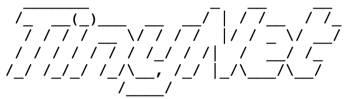

# TinyNet

> The neural network framework implemented in pure python.

## Roadmap

* **Layers**. Fully Connected, Convolution 2D.
* **Activations**. ReLu, Leaky ReLu, Sigmoid.
* **Losses**. Mean Square Error Loss, Cross Entropy Loss.
* **Optimizers**. Stochastic Gradient Descent.
* **Automatical Gradient solver**.

## Documents.

TBD.

## Credits

I was inspired by the following materials:

* https://wiseodd.github.io/techblog/2016/07/16/convnet-conv-layer/
* http://cs231n.stanford.edu/
* https://cs230.stanford.edu/