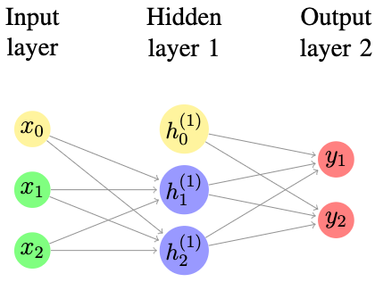

Back Propagation
=================

In this section, we will use a fully connected neural network shown as
below.

   Illustration of the simple neural network we will be using.

We will use the following notation to help us demonstrate the process.
In the following, by default we will have

-  :math:`x_i` is the input of the neural network. There are two inputs
   in our examples which are :math:`x_1=0.25, x_2=0.65` and the bias
   :math:`x_0=0.30`.

-  :math:`h_i^{(j)}` are the data in :math:`i`-th node of :math:`j`-th
   layer. Then the weights that :math:`j`-th layer use to multiply with
   its input is denoted by :math:`w_{pq}^{j}` where :math:`q` is the
   :math:`q`-th node of :math:`j`-th layer, and :math:`p` is the node in
   :math:`(j-1)`-th layer. For example, the weight between :math:`x_1`
   and :math:`h_1^{(1)}` are denoted by :math:`w^{1}_{11}`. In addition,
   we use :math:`b_j` to denote the bias in :math:`j`-th layer. We
   assume that we have
   :math:`w^{1}_{11}=0.20, w^{1}_{12}=0.25, w^{1}_{21}=0.30, w^{1}_{22}=0.35, b_{1}=0.40`
   and
   :math:`w^{2}_{11}=0.50, w^{2}_{12}=0.55, w^{2}_{21}=0.60, w^{2}_{22}=0.65`.
   In our case, there is only one bias in the hidden layer
   :math:`h_0^{(1)}` and we set it to be :math:`h_0^{(1)}=0.20`

-  :math:`y_i` is the :math:`i`-th predicted output, and :math:`y_i` is
   the corresponding ground truth. In our case, we have
   :math:`\hat{y_1}=0.99` and :math:`\hat{y_2}=0.01`.

-  In this example, we will use mean square error, i.e.
   :math:`l=\frac{1}{2}\sum_{i=1}^{2}(y_i-\hat{y_i})^2`. We will use
   stochastic gradient descent (SGD) to optimize our weights, and in our
   optimizer, the learning rate :math:`\lambda` is set to be
   :math:`0.1`. We will use ReLu activation layer after every layer.

With these parameters, we can perform the first forward pass:

| :math:`h_1^{(1)}=x_1 * w^{1}_{11} + x_2 * w^{1}_{21} + x_0=0.25*0.20+0.65*0.30+0.30=0.545`
  and
| :math:`h_2^{(2)}=x_1 * w^{1}_{12} + x_2 * w^{1}_{22} + x_0 = 0.25*0.25+0.65*0.35+0.30=0.59`.

Then after the relu activation these values remained since they are all
positive, then

| :math:`\hat{y_1}=h_1^{(1)} * w^{2}_{11} + h_2^{(1)} * w^{2}_{21} + h_0^{1}=0.545 * 0.50 + 0.59 * 0.60 + 0.20 = 0.8265`
| :math:`\hat{y_2}=h_1^{(1)} * w^{2}_{12} + h_2^{(1)} * w^{2}_{22} + h_0^{1}=0.545 * 0.55 + 0.59 * 0.65 + 0.20 = 0.88325`

Then after the relu activation these values remained since they are all
positive.

Then we can compute the loss with this iteration,
:math:`l=\frac{1}{2}\sum_{i=1}^{2}(y_i-\hat{y_i})^2=\frac{1}{2}(0.8265-0.99)^2+(0.88325-0.01)^2=0.39465`.
Then the gradient will be

| :math:`\frac{\partial l}{\partial y_1}=(y_1-\hat{y_1}) = 0.8265-0.99=-0.1635`
  and
| :math:`\frac{\partial l}{\partial y_2}=(y_2-\hat{y_2}) = 0.88325-0.01=0.87325`.

After this, we want to compute the derivative of the loss with regards
to the weight and bias in the output layer. We have

| :math:`\frac{\partial l}{\partial w^{2}_{11}} = \frac{\partial l}{\partial y_1}\frac{\partial y_1}{\partial w^2_{11}}=-0.1635 * h_1^{(1)}=-0.1635 * 0.545 = -0.0891075`
| :math:`\frac{\partial l}{\partial w^{2}_{12}} = \frac{\partial l}{\partial y_2}\frac{\partial y_2}{\partial w^2_{12}}=0.87325 * h_1^{(1)}=0.87325 * 0.545 = 0.47592125`
| :math:`\frac{\partial l}{\partial w^{2}_{21}} = \frac{\partial l}{\partial y_1}\frac{\partial y_1}{\partial w^2_{21}}=-0.1635 * h_1^{(1)}=-0.1635 * 0.59 = -0.096465`
| :math:`\frac{\partial l}{\partial w^{2}_{22}} = \frac{\partial l}{\partial y_2}\frac{\partial y_2}{\partial w^2_{22}}=0.87325 * h_1^{(1)}=0.87325 * 0.59 = 0.5152175`

| Then we found that the bias :math:`h_0` will impact the loss in two
  ways: by impacting :math:`y_1` and :math:`y_2`. Thus we can first
  convert the bias into a vector, and optimize the values in the vector
  accordingly. For example, in our case, we have
  :math:`h_0^{(1)}=[h_{01}^{1}, h_{02}^{1}]=[0.20, 0.20]`, and the
  gradient will be
| :math:`\frac{\partial l}{\partial h_{01}^{1}}=\frac{\partial l}{\partial y_1}\frac{\partial y_1}{\partial h_{01}^{1}}=\frac{\partial l}{\partial y_1}=-0.1635`
| :math:`\frac{\partial l}{\partial h_{02}^{1}}=\frac{\partial l}{\partial y_2}\frac{\partial y_2}{\partial h_{02}^{1}}=\frac{\partial l}{\partial y_2}=0.87325`

Then the gradient that we will pass to the previous layer, i.e.
:math:`\frac{\partial l}{\partial h^{(1)}_{ij}}` can be computed as
below:

:math:`\frac{\partial l}{\partial h^{(1)}_{1}}=\frac{\partial l}{\partial y_1}\frac{\partial y_1}{\partial h^{(1)}_{1}} + \frac{\partial l}{\partial y_2}\frac{\partial y_2}{\partial h^{(1)}_{1}}=-0.1635 * w^2_{11} + 0.87325 * w^2_{12}=-0.1635 * 0.50 + 0.87325 * 0.55 =0.3985375`

:math:`\frac{\partial l}{\partial h^{(1)}_{2}}=\frac{\partial l}{\partial y_1}\frac{\partial y_1}{\partial h^{(1)}_{2}} + \frac{\partial l}{\partial y_2}\frac{\partial y_2}{\partial h^{(1)}_{2}}=-0.1635 * w^2_{21} + 0.87325 * w^2_{22}=-0.1635 * 0.60 + 0.87325 * 0.65 =0.4695125`

With these derivatives, we can update the weight and bias in the output
layer, here we will use the learning rate :math:`\lambda = 0.1`. Then

| :math:`w^{2}_{11}=w^{2}_{11} - \lambda \frac{\partial l}{\partial w^{2}_{11}}=0.50-0.1*(-0.0891075)=0.50891075`
| :math:`w^{2}_{12}=w^{2}_{12} - \lambda \frac{\partial l}{\partial w^{2}_{12}}=0.55-0.1*(0.47592125)=0.502407875`
| :math:`w^{2}_{21}=w^{2}_{21} - \lambda \frac{\partial l}{\partial w^{2}_{21}}=0.60-0.1*(-0.096465)=0.6096465`
| :math:`w^{2}_{22}=w^{2}_{22} - \lambda \frac{\partial l}{\partial w^{2}_{22}}=0.65-0.1*(0.5152175)=0.59847825`
  and
| :math:`h^{2}_{01}=h^{2}_{01} - \lambda \frac{\partial l}{\partial h^{2}_{01}}=0.20-0.1*(-0.1635)=0.21635`
| :math:`h^{2}_{02}=h^{2}_{02} - \lambda \frac{\partial l}{\partial h^{2}_{02}}=0.20-0.1*(0.87325)=0.112675`

Until now, we have successfully updated the value in the output layer,
and afterwards, we will need to iteratively update the value in previous
layers. Before working on the iterative process, in order to make the
computation clean, we will use the matrix format. Here we already have
the gradient that the output layer passed to hidden layer denoted by
:math:`\nabla_2 = [\frac{\partial l}{\partial h^{(1)}_{1}}, \frac{\partial l}{\partial h^{(1)}_{2}}]=[0.3985375, 0.4695125]`.
Then

:math:`\frac{\partial l}{\partial w_{ij}^{1}}=\frac{\partial l}{\partial h^{1}_{j}}\frac{\partial h^{1}_{j}}{\partial w_{ij}^{1}}`.
Thus we will have

.. math::

   \left[ {\begin{array}{*{20}c} 
       \frac{\partial l}{\partial w_{11}^{1}} & \frac{\partial l}{\partial w_{12}^{1}}  \\
       \frac{\partial l}{\partial w_{21}^{1}} & \frac{\partial l}{\partial w_{22}^{1}} 
       \end{array} } \right]=\left[ {\begin{array}{*{20}c} 
           0.25  \\
           0.65 
           \end{array} } \right]\left[ {\begin{array}{*{20}c} 
               0.3985375 & 0.4695125\\
               \end{array} } \right]=\left[ {\begin{array}{*{20}c} 
                   0.09963437 & 0.11737812  \\
                   0.25904938 & 0.30518312
                   \end{array} } \right]

Then for the bias, we have
:math:`\frac{\partial l}{\partial x_0}=\frac{\partial l}{\partial h_j}`.
Therefore
:math:`[\frac{\partial l}{\partial x_{01}},\frac{\partial l}{\partial x_{02}}]=[0.3985375, 0.4695125]`.

With these parameters, we can update the parameters in the hidden layer.

| :math:`w^{1}_{11}=w^{1}_{11} - \lambda \frac{\partial l}{\partial w^{1}_{11}}=0.20-0.1*(0.09963437)=0.190036563`
| :math:`w^{1}_{12}=w^{1}_{12} - \lambda \frac{\partial l}{\partial w^{1}_{12}}=0.25-0.1*(0.11737812)=0.238262188`
| :math:`w^{1}_{21}=w^{1}_{21} - \lambda \frac{\partial l}{\partial w^{1}_{21}}=0.30-0.1*(0.25904938)=0.274095062`
| :math:`w^{1}_{22}=w^{1}_{22} - \lambda \frac{\partial l}{\partial w^{1}_{22}}=0.35-0.1*(0.30518312)=0.319481688`
  and
| :math:`x_{01}=x_{01} - \lambda \frac{\partial l}{\partial x_{01}}=0.20-0.1*(0.3985375)=0.16014625`
| :math:`x_{02}=x_{02} - \lambda \frac{\partial l}{\partial x_{02}}=0.20-0.1*(0.4695125)=0.15304875`

Until now, we have successfully computed a forward pass, a backward pass
and updated all the parameters in the neural network. With the same
procedure, we can compute the new loss :math:`l=0.2384542802724947`. If
the new loss is still unsatifactory, we can repeat the process again and
again to lower the loss until it is satifactory.

The process can be easily implemented in Tinynet with the following code
snippets.

.. literalinclude:: ../../../examples/back_propagation.py
  :language: Python
  :linenos: