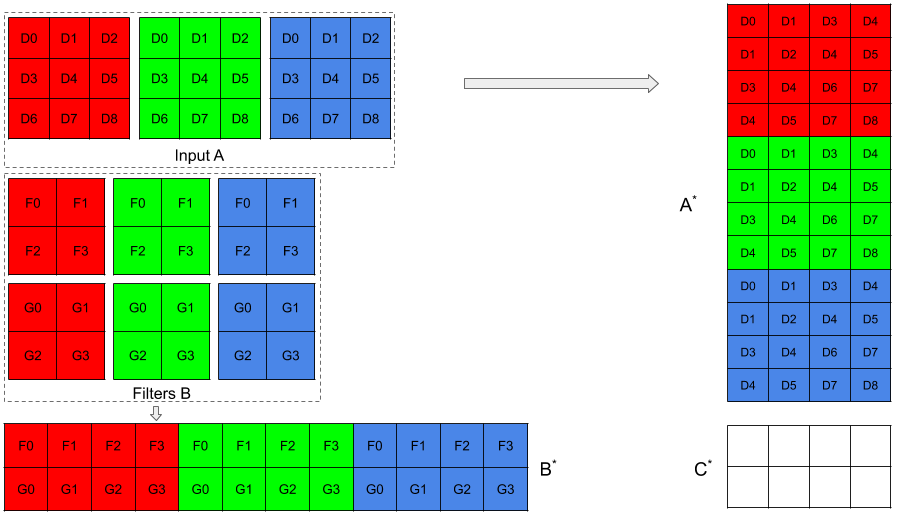

Convolutional Layer
===================

Compared with fully connected layers, convolutional layers is more
difficult to compute. In convolutional layers, we have a spatially small
window sliding on the image. For example, assume we have two matrix
:math:`A_{3\times 3}`, :math:`B_{2\times
2}`, :math:`B` is the sliding window, and

.. math::

   A=\left[ {\begin{array}{*{20}c} 
           1 & 2 & 3 \\
           4 & 5 & 6   \\
           7 & 8 & 9   
           \end{array} } \right], B=\left[ {\begin{array}{*{20}c}
           1 & 2    \\
           3 & 4   
       \end{array} } \right]

We use :math:`a_{ij}` and :math:`b_{ij}` to denote the elements in
:math:`A` and :math:`B`, then the output after convolutional layer would
be

.. math::

   C=\left[ {\begin{array}{*{20}c}
           \sum_{i,j=1}^2 a_{ij}b_{ij} & \sum_{i=1}^{2}\sum_{j=2}^{3} a_{ij}b_{ij-1}   \\
           \sum_{i=2}^{3}\sum_{j=1}^{2} a_{ij}b_{i-1j} & \sum_{i,j=2}^3 a_{ij}b_{i-1j-1}    \\
           \end{array} } \right]=\left[ {\begin{array}{*{20}c}
           37 & 47    \\
           67 & 77   
       \end{array} } \right]

Formally, we can write the forward pass of the convolutional layer as

.. math:: f(x_{ij}) = o_{ij} = \sum_{p=1}^{m}\sum_{q=1}^{n}w_{ij} \times x_{i+p-1, j+q-1} + b

Even though we can compute
:math:`\frac{\partial f(x_{ij})}{\partial x_{ij}}` successfully with the
formula, it can be expected to be complicated with at least two loops.
Computing for the forward and backward passes with loops is inefficient,
thus we need a way to vectorize the computation process and use matrix
multiplication to compute the general matrix problem. Such technique is
called GEMM (**GE**\ neral **M**\ atrix to **M**\ atrix Multiplication).
To do so, we need to formalize the convolution operation in more detail.

The input to a convolution operation is a :math:`w\times h\times c`
matrix where :math:`w` is the width of the image, :math:`h` is the
height of the image, and :math:`c` is the channel of the image. For
example, a colored RGB image of size :math:`(224,224)` can be
represented as a :math:`224\times 224\times 3` tensor. At the same time,
the sliding window has three properties, the height, the width of the
filter and the number of output feature maps. These properties are
denoted by :math:`h_f`, :math:`w_f` and :math:`K`. Then since we are
sliding the window on the image, we have a vertical stride :math:`s_v`
and a horizontal stride :math:`s_h`. In the edge region, there might be
no data in a window, and in that case, we need to add padding to the
original input. In summary, we have the following notations as shown in the table:

============= ===============================
Parameter     Meaning                          
============= ===============================
:math:`N`     Number of data in a batch        
:math:`W`     Width of the 2D data             
:math:`H`     Height of the 2D data            
:math:`C`     Channel of the 2D data           
:math:`H_f`   Height of the filters            
:math:`W_f`   Width of the filters             
:math:`K`     Number of output feature maps    
:math:`S_v`   Vertical stride of the window    
:math:`S_h`   Horizontal stride of the window  
:math:`Pad_v` Vertical padding                 
:math:`Pad_h` Horizontal padding               
============= ===============================

[table_1]

With these notations, we can formalize the input, sliding window and the
output as below:

-  The input is a :math:`(N, C, H, W)` tensor.

-  The sliding window, or called filter is a :math:`(K, C, H_f, W_f)`
   tensor.

-  The output is a :math:`(N, K, P, Q)` tensor, where :math:`P, Q` is
   the width and height of the output.

The technique that improve the efficiency is called *im2col*. As suggested in `cuDNN: Efficient Primitives for Deep Learning <https://arxiv.org/abs/1410.0759>`_, we can convert the input :math:`(N,C,H,W)` tensor to a matrix with the size :math:`(CRS, NPQ)` and reshape the filter from a :math:`(K, C, H_f, W_f)` tensor to a :math:`(K, CH_fW_f)` matrix. To
achieve this goal, we use a sliding window with the size
:math:`(H_f, W_f)` and extract all the regions from the input, and then
reshape them into columns. After that we combine all the columns
together and will get a :math:`(CRS, NPQ)` matrix. For the filters, it
is straightforward as we only need to concatenate the last three
dimensions. For example, with the matrix :math:`A` and :math:`B`, we can
to convert them as

.. math::

   A^*=\left[ {\begin{array}{*{20}c} 
           1 & 2 & 4 & 5   \\
           2 & 3 & 5 & 6   \\
           4 & 5 & 7 & 8   \\
           5 & 6 & 8 & 9
           \end{array} } \right], B^*=\left[ {\begin{array}{*{20}c}
           1 & 2 & 3 & 4    \\
              
       \end{array} } \right]

Then we have :math:`C^*=A^*B^*=[37, 47, 67, 77]`. If we reshape them
back to :math:`2\times 2`, we will have :math:`C^*_{2\times 2}=C`.

   Illustration of convering input data and filter into matrices

In Fig. `1`_, we have a colored image and the input can be represented
as a :math:`(1,3,3,3)` tensor :math:`A`, and filters set with :math:`2`
output features map and these filters can be represented as a
:math:`(2,3,2,2)` tensor :math:`B`. We can then convert them into
matrices :math:`A^*` and :math:`B^*` as shown in the image, and we will
then have :math:`C^*=A^*B^*`. We can then reshape :math:`C^*` to get the
output of convolutional layer.

The benefit of using the *im2col* technique is that we can convert the
complex convolutional operation into matrix multiplication. We can use
:math:`x^*` to denote the input data in column format and :math:`w^*`,
:math:`b^*` to denote the parameters in the convolutional layer. Then
similar to fully connected layer, we will have
:math:`f(x_{ij}^*)=w^*x_{ij}^*+b^*`, and the derivative also becomes
straightforward as we have:

-  :math:`\frac{\partial l}{\partial w^*_{ij}}=\frac{\partial l}{\partial f}\frac{\partial f}{\partial w^*_{ij}}=\frac{\partial l}{\partial f}x^*_{ij}`.

-  :math:`\frac{\partial l}{\partial b^*_{ij}}=\frac{\partial l}{\partial f}`

-  :math:`\frac{\partial l}{\partial x^*_{ij}}=\frac{\partial l}{\partial f}\frac{\partial f}{\partial x^*_{ij}}=\frac{\partial l}{\partial f}w^*_{ij}`

After computing these derivatives, all we need to do is to convert it
back to original tensors.

The implementation of dropout layer in Tinynet is as below:

.. literalinclude:: ../../../tinynet/layers/convolution.py
  :language: Python
  :linenos:

.. _1: #fig_2

