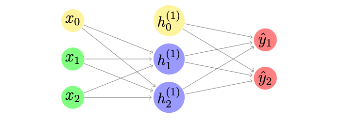
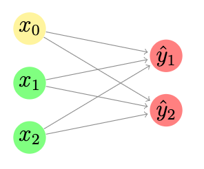

Fully Connected Layers
======================

**Definition** The fully connected layer is the simplest and most
fundamental neural network component as it connects all the nodes in a
layer to all the nodes in the next layer. For example, in the below figure we present a simple fully connected layer that connects all
nodes, in which yellow nodes represent the bias (the nodes that are
independent of the output of the previous layer) in each layer, green
nodes represent the input to the neural network, blue nodes represent
the intermediate activities and red nodes represent the output results.

   An Example of Fully Connected Layer

From the definition of fully connected layer, we know that in the
:math:`i`\ th layer, if there are :math:`n^{(i)}` input nodes (in our
figure, :math:`n^{(1)}=2` (the green nodes), :math:`n^{(2)}=2` (the blue
nodes)) and :math:`m^{(i)}` output nodes (in our figure,
:math:`m^{(0)}=2` (the blue nodes), :math:`m^{(1)}=2` (the red nodes)),
there will be :math:`m^{(i)}\times n^{(i)}` relations between them.
These relations can be represented as a :math:`m^{(i)}\times n^{(i)}`
matrix :math:`w^{(i)}` (weight). Besides of these relations, there will
be :math:`m^{(i)}` biases that can be represented as a
:math:`m^{(i)}`\ d vector :math:`b^{(i)}` (bias). (in our figure,
:math:`b^{(0)}=2` (:math:`x_0` to :math:`h_1^{(1)}` and :math:`x_0` to
:math:`h_2^{(1)}`), :math:`b^{(1)}=2` (:math:`h_0^{(1)}` to
:math:`\hat{y}_1` and :math:`h_0^{(1)}` to :math:`\hat{y}_2`))

**Forward Pass** With the above notations, we can directly compute the
forward pass. For example, in the example, we can compute
:math:`h_1^{(1)}` as
:math:`h_1^{(1)}=x_1w^{(1)}_{11}+x_2w^{(1)}_{21}+x_0` where
:math:`w^{(i)}_{jk}` is the relation between :math:`x_j` and
:math:`h^{(i)}_{k}`. In matrix form, we have :math:`\hat{Y}=Xw+b` where
:math:`w` is the weight matrix, :math:`X` is the input vector and
:math:`b` is the bias vector. In the matrix form, :math:`w` is a
:math:`n\times m` matrix, :math:`X` is a :math:`n`\ d vector and
:math:`b` is a :math:`m`\ d vector.

**Backward Pass** In the training process, we want to update the
relations between the input nodes and the output nodes. More
specifically, we want to know how the weight :math:`w` and bias
:math:`b` will impact the loss value, i.e. we want to compute
:math:`\frac{\partial\ell}{\partial w}` and
:math:`\frac{\partial\ell}{\partial b}`. In the backward pass, the
:math:`i`\ th layer will receive the gradient of the loss value with
respect to the input of the :math:`(i+1)`\ th layer. As the input of the
:math:`(i+1)`\ th layer is the output of the :math:`i`\ th layer, we
have :math:`\frac{\partial\ell}{\partial \hat{y}_i}` known indeed.

With these conditions, we can apply the laws we have to compute the
gradients. We will have

-  :math:`\frac{\partial\ell}{\partial w}=X^T\nabla^{(i)}` (Using the
   Law 1)

-  :math:`\frac{\partial\ell}{\partial b}=\frac{\partial\ell}{\partial \hat{y}^i}\frac{\partial \hat{y}^i}{\partial b}=\nabla^{(i)}`

With these results, we can update the weight and bias in the
:math:`i`\ th layer with
:math:`w^{new}=w^{old}-\epsilon \nabla^{(i)} x^T` and
:math:`b^{new}=b^{old}-\epsilon \nabla^{(i)}` where :math:`\epsilon` is
a preset hyperparameter called learning rate. After updating these
parameters, we need to pass the gradient of the loss with respect to the
input of this layer to the previous layer. Formally, we also have
:math:`\frac{\partial\ell}{\partial x^{i}}=\nabla^{(i)} w^T` (Using the
Law 2).

----------
 Example
----------

Assume we have a simple fully connected neural network with only two
layers, and each layer have two inputs and two outputs. It can be
visualized as below:

   Another Example of Fully Connected Layer

In the above example, we initialize the values as the following:

-  In the input layer, we assume the inputs are :math:`x_1=0.1` and
   :math:`x_2=0.5`. Thus the input can be represented by a :math:`2`\ d
   vector :math:`X=[0.1,0.5]`

-  Since there are :math:`2` input nodes, and :math:`2` output nodes,
   the weight can be represented as a :math:`2\times 2` matrix. We
   assume it to be :math:`w^{(0)}=\left[ {\begin{array}{*{20}c} w^{(0)}_{11} & w^{(0)}_{12}  \\w^{(0)}_{21} & w^{(0)}_{22}  \\ \end{array} } \right]=\left[ {\begin{array}{*{20}c} 0.15 & 0.20  \\0.25 & 0.30  \\ \end{array} } \right]` where :math:`w^{(i)}_{kj}` is the weight between :math:`x_k^{(i)}` and :math:`y_j^{(i)}`. For example,
   :math:`w^{(0)}_{11}` is the weight between :math:`x_1` and
   :math:`y_1` in our case.

-  Since there are :math:`2` output nodes, the biases can be represented
   as a :math:`2`\ d vector. In our example, we assume it to be
   :math:`b^{(0)}=[0.35, 0.45]`.

-  In order to compute the backward pass, we need to give a ground truth
   of the output nodes, so that we can compute the loss value and
   perform the backpropagation. Here we assume that the ground truth is
   :math:`y_1=0.01` and :math:`y_2=0.99`. Thus the output can be
   represented by a :math:`2`\ d vector :math:`Y=[0.01, 0.99]`.

*Forward Pass* In the forward pass, we want to compute :math:`\hat{Y}`.
In our case,
:math:`\hat{Y}=Xw^{(0)}+b^{(0)}=[0.1, 0.5]\left[ {\begin{array}{*{20}c} 0.15 & 0.20  \\0.25 & 0.30  \\ \end{array} } \right]+[0.35, 0.45]=[0.49, 0.62]`

Then with the predicted :math:`Y`, we can compute the loss value as
:math:`\ell=\frac{1}{2}[(0.49-0.01)^2+(0.62-0.99)^2]=0.18365`. We also
need to compute the gradient of the loss with respect to the output as
:math:`\frac{\partial \ell}{\partial \hat{y}_1}=\hat{y}_1-y_1=0.48, \frac{\partial \ell}{\partial \hat{y}_2}=\hat{y}_2-y_2=-0.37`.
Hence, we have :math:`\nabla^{(1)}=[0.48, -0.37]`.

*Backward Pass* Then in the backward pass, as shown above, we can
compute the gradient of the loss with respect to the weight, bias and
the input. In our case, we have

-  :math:`\frac{\partial \ell}{\partial w}=X^T \nabla^{(1)} =[0.1, 0.5]^T[0.48, -0.49]=\left[ {\begin{array}{*{20}c}0.048 & -0.037  \\0.24 & -0.185  \\ \end{array} } \right]`

-  :math:`\frac{\partial \ell}{\partial b}=\nabla^{(1)}=[0.48, -0.37]`

-  :math:`\frac{\partial \ell}{\partial x}=\nabla^{(1)} w^T=[0.48, -0.37]\left[ {\begin{array}{*{20}c} 0.15 & 0.20  \\0.25 & 0.30  \\ \end{array} } \right]=[-0.002, 0.009]`

*Numerical Verification* In order to verify that our derivatives are
induced correctly, we can compute the derivatives numerically. In order
to do so, we firstly let :math:`\epsilon=0.01` and then we can compute
the derivatives of the loss value with respect to the :math:`w` as the
following:

Similarly, we can do the same procedures for :math:`w_{12}^{(0)}`,
:math:`w_{21}^{(0)}` and :math:`w_{22}^0`. After computation, we have
:math:`\frac{\partial \ell}{w_{12}^{(0)}}=\frac{0.1832805-0.1840205}{0.02}=-0.037`,
:math:`\frac{\partial \ell}{w_{21}^{(0)}}=\frac{0.1860625-0.1812625}{0.02}=0.24`
and
:math:`\frac{\partial \ell}{w_{22}^{(0)}}=\frac{0.184225-0.187925}{0.02}=-0.185`.
With these four values we can form the matrix of the loss value with
respect to the weight matrix as
:math:`\frac{\partial \ell}{\partial w}=\left[ {\begin{array}{*{20}c} 0.048 & -0.037  \\0.24 & -0.185  \\ \end{array} } \right]` and this result is consistent with the matrix we get from our inductions. By far we verified that we are computing the derivatives correctly for the weight.

Similarly, we proceed to verify the biases as following:

-  There are two biases in our case, :math:`b^{(0)}_{1}=0.35` and
   :math:`b^{(0)}_2=0.45`. For :math:`b^{(0)}_{1}`, we define
   :math:`b_{left}=b^{(0)}_{1}-\epsilon=0.34` and
   :math:`b_{right}=b^{(0)}_{1}+\epsilon=0.36`. Then we have

   -  :math:`y_{left}=Xw+b^{(0)}_{left}=[0.1, 0.5]\left[ {\begin{array}{*{20}c} 0.15 & 0.20  \\                  0.25 & 0.30  \\                  \end{array} } \right]+[0.34, 0.45]=[0.48, 0.62]`, and
      :math:`\ell_{left}=\frac{1}{2}[(0.48-0.01)^2+(0.62-0.99)^2]=0.1789`.

   -  :math:`y_{right}=Xw+b^{(0)}_{right}=[0.1, 0.5]\left[ {\begin{array}{*{20}c}                   0.15 & 0.20  \\                  0.25 & 0.30  \\                   \end{array} } \right]+[0.36, 0.45]=[0.50, 0.62]`, and
      :math:`\ell_{right}=\frac{1}{2}[(0.50-0.01)^2+(0.62-0.99)^2]=0.1885`.

   -  Then we can compute the derivative of loss with respect to the
      bias :math:`b_{11}^{(0)}` as
      :math:`\frac{\partial \ell}{b_{11}^{(0)}}=\frac{\ell_{right}-\ell_{left}}{2\epsilon}=\frac{0.1885-0.1789}{0.02}=0.48`.

-  For :math:`b_{12}^{(0)}`, after computation, we have
   :math:`\frac{\ell}{b_{12}^{(0)}}=\frac{0.18485-0.19225}{0.02}=-0.37`.
   Hence we have :math:`\frac{\partial \ell}{\partial b}=[0.48, -0.37]`
   and it is consistent with the results we have before.

After verified the weights and biases, we now proceed to verify the
input matrix as below:

-  There are two inputs in our example, the :math:`x_1^{(0)}=0.1` and
   :math:`x_2^{(0)}=0.5`. For :math:`x_1^{(0)}`, we define
   :math:`x_{left}=x_1^{(0)}-\epsilon=0.09`,
   :math:`x_{right}=x_1^{(0)}+\epsilon=0.11` and :math:`X_{left}`,
   :math:`X_{right}` are the corresponding matrices. Then we have:

   -  :math:`y_{left}=X_{left}w+b^{(0)}=[0.09, 0.5]\left[ {\begin{array}{*{20}c} 0.15 & 0.20  \\ 0.25 & 0.30  \\ \end{array} } \right]+[0.35, 0.45]=[0.4885, 0.618]`,
      and
      :math:`\ell_{left}=\frac{1}{2}[(0.48-0.01)^2+(0.62-0.99)^2]=0.183673125`.

   -  :math:`y_{right}=X_{right}w+b^{(0)}=[0.11, 0.5]\left[{\begin{array}{*{20}c}0.15 & 0.20  \\0.25 & 0.30  \\ \end{array}} \right]+[0.35, 0.45]=[0.4915, 0.622]`,
      and
      :math:`\ell_{right}=\frac{1}{2}[(0.4915-0.01)^2+(0.622-0.99)^2]=0.183633125`.

   -  Then we can compute the derivative of loss with respect to the
      input :math:`x_{1}^{(0)}` as
      :math:`\frac{\partial l}{\partial x_{1}^{(0)}}=\frac{0.183633125-0.183673125}{0.02}=-0.002`.

-  Similarly, for :math:`x_2^{(0)}`, after computation, we have
   :math:`\frac{\partial \ell}{\partial x_{2}^{(0)}}=\frac{0.183747625-0.183567625}{0.02}=0.009`.
   Hence we will have
   :math:`\frac{\partial \ell}{\partial X}=[-0.002, 0.009]`, and the
   result is consistent with our results above.

By performing the numerical verification as cross-validation, we can
confirm that our inductions and computations are correct. With knowing
the forward pass and backward pass, we now proceed to investigate how
convolution and other operations work.

The implementation of fully connected layer in tinyml is as below:

.. literalinclude:: ../../../tinyml/layers/linear.py
  :language: Python
  :linenos:

